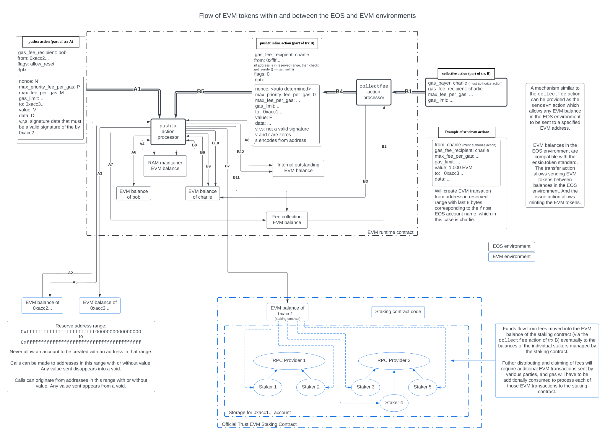

# EVM token flow

**Transaction A**:

1. The `pushtx` action within EOS transaction A is processed by the EVM runtime contract. It carries out initial validation on the fields.
2. Sufficient EVM tokens are pulled from the EVM balance of account `0xacc2...` to cover the maximum gas costs (`L` times the gas price which is calculated to be the minimum of `M` and the sum of `P` plus the base gas price) and the value `V`.
3. The value `V` of the EVM transaction goes to the `to` address `0xacc3...`.
4. At the end of processing the EVM transaction, assuming the transaction does not revert e.g. due to running out of gas, the actual gas  consumed is known including how that breaks down to a storage portion (gas attributable to additional storage costs) and a computation portion (all other gas consumed). The storage portion of the gas multiplied by the base gas price determines how much of the initial gas fee collected first goes to the RAM maintainer EVM balance. In addition, the EVM runtime contract calculates a gas fee refund due to reduction of storage costs or possibly overpayment to RAM maintainer EVM balance. This gas fee refund is pulled back from the RAM maintainer EVM balance and it could potentially be greater than the portion of the initial gas fee moved into the RAM maintainer EVM balance a moment prior. 
5. The gas fee refund plus the product between the gas price and the difference between the gas limit `L` and the actual gas consumed determines the total fee that is returned back to the sender. Note that because the gas fee refund can be considerably greater than the storage portion of the gas multiple by the base gas price, it is possible that the total fee returned back to the sender could even be greater than the initial gas fee collected from the sender. Also note that if one were to subtract the initial gas fee collected from the sender (which is the total amount pulled by step 2 minus `V`) by the total fee returned back to the sender (which is the total amount pushed back by step 5), that difference (aka the net gas fee) must equal to sum of the net change to the RAM maintainer EVM balance and the computation portion of the gas fee (which is the sum of the product of `P` times the storage portion of the gas plus the product of the gas price times the computation portion of the gas).
6. A fraction (configurable in the EVM runtime contract) of the computation portion of the gas fee is sent to the `gas_fee_recipient` account as "write rewards" compensation for the CPU/NET costs incurred by the miner.
7. The remaining fraction of the computation portion of the gas fee is sent to the special fee collection EVM balance. This is revenue collected by Trust EVM which it uses to incentive RPC providers to provide their services.
8. From the perspective of the EVM environment, the sender's balance is reduced by the sum of `V` and the net gas fee (and since the net gas fee can be negative, this could mean that the sender's balance could in fact increase). For the sake of consistency, this means the net gas fee must be exactly reproducible by a node following the constructed virtual EVM blockchain using an EVM-based protocol with modifications to the gas calculation algorithm (specifically it needs to know how to compute the gas fee refund). From the perspective of the EVM environment, the net gas fee disappears into (or, if negative, appears from) the void. To ensure the accounting is balanced within the EOS environment, the net gas fee must be subtracted from the internal outstanding EVM balance (the arrow is bidirectional because the net gas fee could be negative).

**Transaction B**:

1. The `collectfee` action within EOS transaction B is processed by the EVM runtime contract. It can be called by anyone who is willing to pay for the gas costs of the internal EVM transaction it will create to move the EVM tokens collected in the special fee collection EVM balance within the EOS environment to the official Trust EVM staking contract within the EVM environment.
2. All of the EVM tokens collected in the fee collection EVM balance, let us call this amount `F`, is removed from that balance.
3. The collected fees amounting to `F` EVM tokens are then added to the balance of the account specified in the `gas_payer` field of the `collectfee`, in this case `charlie`. The fees will never in effect be transferred to `charlie` by the end of the transaction; they are simply temporarily held at this balance since `charlie` acts as the intermediary to move the collected fees to the official Trust EVM staking contract as the intended final recipient of the fees.
4. The EVM runtime contract then generates an inline `pushtx` action to itself. The `gas_fee_recipient` field is set to the `gas_fee_recipient` specified in the `collectfee` action, in this case also `charlie`. The `from` field is set to a special address in the reserved range which corresponds to the `charlie` account (the account specified as the `gas_payer` in the `collectfee` action). The `flags` field does not include the `allow_revert` flag which means that if the initial EVM call is reverted, the transaction will be aborted. This is important to ensure that no matter what happens with the EVM transaction, the EOS transaction will never successfully complete with `charlie` having possession over the collected fees. Finally, the `rlptx` encodes the EVM transaction that will be processed. The `value` field of this transaction is `F`. The `to` field is set to the address for the official Trust EVM staking contract within the EVM environment which is known to the EVM runtime contract. The signature fields `v`, `r`, `s` do not encode a valid signature for the EVM transaction. Instead, they encode the `from` address. The remaining fields are set appropriately based either on values specified in the `collectfee` action (e.g. `max_fee_per_gas` or `gas_limit`) or automatically (e.g. `nonce` or `data`).
5. The inline `pushtx` action generated by the `collectfee` action is processed by the EVM runtime contract. Because the `from` address is within the reserved range, it will ensure that this is an inline action sent by the EVM runtime contract itself, or else it will abort the transaction. In addition, because the `from` address is in the reserved range, it will not validate the signature as it normally would, but instead will ensure that it has the proper encoding of the `from` address.
6. Sufficient EVM tokens are pulled from the EVM balance of the `charlie` account (note that this is now a balance within the EOS environment) to cover the maximum gas costs (`gas_limit` times the gas price which is calculated to be the minimum of `max_fee_per_gas` and the sum of `max_priority_fee_per_gas` plus the base gas price) and the value `F`. The EVM runtime contract knows which account within the EOS environment to pull funds from when processing this EVM transaction because it knows the account name mapped to by the `from` address within the reserved range.
7. The value `F` of the EVM transaction goes to the `to` address `0xacc1...` which is the address of the staking contract. This makes the collected fees available to the staking contract to be later distributed to the various stakers proportionally.
8. Like in the case of transaction A, a net change occurs in the RAM maintainer EVM balance by adding the storage portion of the gas multiplied by the base gas price and the subtracting the gas fee refund. The arrow is bidirectional because that net change can be negative.
9. Like in the case of transaction A, the gas fee refund plus the product between the gas price and the difference between `gas_limit` and the actual gas consumed determines the total fee that is returned back to the sender (which in this case means the funds go back to the EVM balance for `charlie` within the EOS environment).
10. Like in the case of transaction A, a fraction of the computation portion of the gas fee is sent to the `gas_fee_recipient` account, which in the case is again `charlie`, as "write rewards" compensation for the CPU/NET costs incurred by the miner.
11. The remaining fraction of the computation portion of the gas fee is again sent to the special fee collection EVM balance. This means that even after processing the `collectfee` action, the fee collection EVM balance will always end up with some small positive balance remaining.
12. Similar to the case of transaction A, to ensure the accounting is balanced within the EOS environment, the internal outstanding EVM balance must be adjusted. In this case, the net gas fee both appears from and disappears into the void. However, now the actual value `F` is appearing from the void. So to maintain accounting balance, `F` must also be added into the internal outstanding EVM balance.